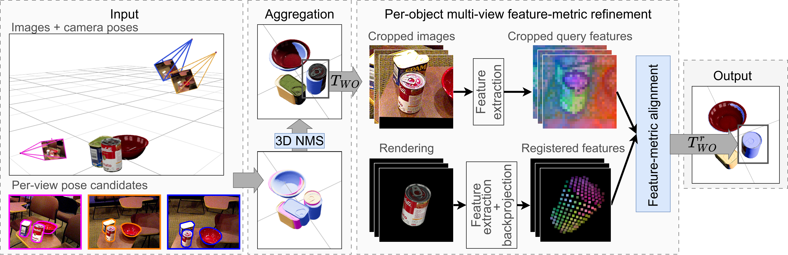

<p align="center">
  <h1 align="center">AlignPose: Generalizable 6D Pose Estimation via <br> Multi-view Feature-metric Alignment</h1>
  <p align="center">
    <a href="">Anna Šárová Mikeštíková</a>
    ·
    <a href="https://medericfourmy.github.io">Médéric Fourmy</a>
    ·
    <a href="https://cifkam.github.io">Martin Cífka</a>
    ·
    <a href="http://people.ciirc.cvut.cz/~sivic/">Josef Sivic</a>
    .
    <a href="https://petrikvladimir.github.io">Vladimir Petrik</a>
  </p>
  <h3 align="center">
    <a href="https://arxiv.org/abs/2512.20538" align="center">Arxiv</a>
    ·
    <a href="https://mikestikova.github.io/alignpose/" align="center">Project Page</a>
  </h3>
</p>

<p align="center">
  
</p>

This repository contains code for AlignPose, our method for 6 object pose estimation from multiple views. It provides a pipeline to run multi-view featuremetric refinement for [BOP](https://bop.felk.cvut.cz/) datasets.

## Table of Contents

- [Setup](#setup)
   - [Environment](#environment)
   - [Dataset](#dataset)
- [Running Alignpose](#alignpose)
- [Acknowledgements](#acknowledgements)
- [License](#license)

## Setup <a name="setup"></a>

### Environment <a name="environment"></a>

Download the code with the git submodules and navigate to the folder:

```bash
git clone --recurse-submodules https://github.com/mikestikova/alignpose_project.git
cd alignpose_project
```

Setup the [conda](https://docs.conda.io/projects/conda/en/latest/user-guide/getting-started.html) environment for CUDA:
```bash
conda env create -f conda_alignpose_gpu.yaml
```

Next, create (or update) the conda environment activation script to set the necessary environment variables. This script will run automatically when you activate the environment.

The activation script is typically located at ```$CONDA_PREFIX/etc/conda/activate.d/env_vars.sh```. You can find ```$CONDA_PREFIX``` by running:
```bash
conda info --envs
```
If the ```env_vars.sh``` file does not exist, create it. 

Edit the ```env_vars.sh``` file as follows:

```bash
#!/bin/sh

export ALIGNPOSE=/path/to/alignpose/repository  # Replace with the path to the AlignPose repository.
export BOP_PATH=/path/to/bop/datasets  # Replace with the path to BOP datasets (https://bop.felk.cvut.cz/datasets).

export PYTHONPATH=$ALIGNPOSE:$ALIGNPOSE/src/external/bop_toolkit:$ALIGNPOSE/src/external/dinov2:$ALIGNPOSE/src/external/pixloc
```

Activate the conda environment:
```bash
conda activate alignpose_gpu
```

### Dataset <a name="dataset"></a>
Download the BOP datasets from [here](https://bop.felk.cvut.cz/datasets/). 
Note that we only need the `base` archive with the dataset info, `models` folder and `test` folder. Extract dataset to this [format.](https://github.com/thodan/bop_toolkit/blob/master/docs/bop_datasets_format.md)

In addition to the test images, this method needs a specification of which views shoud be used together in the multi-view setup:
- BOP Industrial (IPD, XYZIBD, ITODDMV) contain `test_targets_multiview_bop25.json` file.
- BOP Classic Core (YCBV, TLESS) do not contain this file so we provide it in `data/bop_test_targets/{dataset}/test_targets_multiview_bop25.json`. These files were generated for 4-view setup.  

## Running Alignpose<a name="alignpose"></a>
Currently we support BOP datasets from BOP-Industrial track (ITODD-MV, XYZ-IBD, IPD) and selected datasets from BOP-Classic track (YCB-V, T-LESS).

### Generate templates:
Specify your configs in `src/configs/gen_templates/ycbv.json` and run the template generation:
```bash
python src/scripts/gen_templates.py --opts-path src/configs/gen_templates/ycbv.json
```

### Generate obejct representation
Specify your configs in  `src/configs/gen_repre/ycbv.json` and generate PCA per-object representation:
```bash
python src/scripts/gen_repre.py --opts-path src/configs/gen_repre/ycbv.json
```

### Prepare input pose estimates
Because this is a refinemet method, we need some coarse input poses that will be refined. We provide sample input poses in the `data/inputs` folder. Alternatively, you may download input poses `.csv` files from [BOP Leaderboard](https://bop.felk.cvut.cz/leaderboards/pose-estimation-unseen-bop23/ycb-v/) or generate them with any single-view pose estimation method.

Format of input:
- BOP Classic Core (YCB-V, T-LESS): One `.csv` file with predictions in BOP format.
- BOP Industrial (IPD, XYZIBD, ITODDMV): Folder containing a `.csv` files with predictions for all of the cameras named `{camera_id}-xxxx_{dataset-name}-test.csv`.


### Run multi-view refinement 
Run multi-view refinement using the following script and configuration. The output will be one `.csv` file in BOP format for each camera. 
`configs/refine/ycbv.json`
```bash
python src/scripts/refine_multiview.py --opts-path src/configs/refine_multiview/ycbv.json
```


### BOP Evaluation <a name="bop-evaluation"></a>
Evaluate the BOP submission file by running this script.
```
python scripts/results_bop_evaluate.py --csv_path  path/to/csv/results.csv
```

## Citation
If you find this code useful in your research, please cite:

```
@misc{mikestikova2025alignpose,
      title={AlignPose: Generalizable 6D Pose Estimation via Multi-view Feature-metric Alignment}, 
      author={Anna Šárová Mikeštíková and Médéric Fourmy and Martin Cífka and Josef Sivic and Vladimir Petrik},
      year={2025},
      eprint={2512.20538},
      archivePrefix={arXiv},
      primaryClass={cs.CV},
      url={https://arxiv.org/abs/2512.20538}, 
}
```

## Acknowledgements <a name="acknowledgements"></a>

This repository relies heavily on the following works:
- [BOP Toolkit](https://github.com/thodan/bop_toolkit) -  Evaluation scripts, standard utils
- [FoundPose](https://github.com/facebookresearch/foundpose) - Single-view pose estimation, utils
- [Pixloc](https://github.com/cvg/pixloc) - Featuremetric refinement
